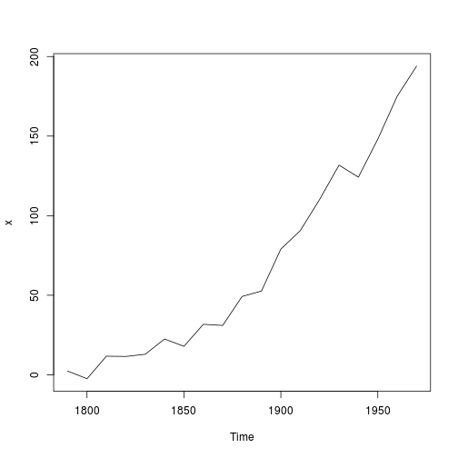
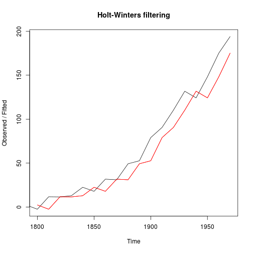
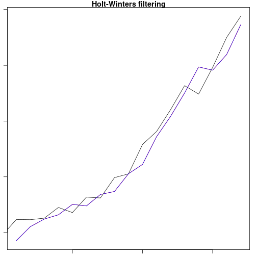

Exponential Smoothing
========================================================
author: CUNY SPS DATA 624
date: 2/19/19
autosize: true


Moving Average
========================================================
- Averages all the previous data to come up with a forecast.
- Does not handle seasonality well
- Does not handle short-term trends changes well 


$$ \\ \frac{1}{n}\sum_{i=0}^{n-1}p_{m-i} $$

Weighted Moving Average
========================================================
- like the above, but there are scalar multipliers included
- defined mathematically as a convolution of the data with a fixed weighting function
- For an n-day moving average, the weights descrease in an arithmetic progression


$$ \\ WMA = np_m + (n-1) p_{m-1} + ... + 2p_{M-n+2} + p_{m-n+1} $$


Simple Exponential Smoothing
========================================================
- Forecast future value using a weighted average of all previous values in the series
- Uses: Forecast a series with no trend and no seasonality
- Advantages: Simple, popular, adaptive, removes high-frequency noise
    + Smoothing constant alpha
        - Alternative form: F(t+1) = F(t) + alpha * E(t)
          i.e. next_forecast = prev_forecast + alpha * (prev_forecast_error)
            
Alpha Parameter
=======================================================
- Set between 0 and 1
- Weights the previous forecast values relative to the new measured values
- Determines how much weight is given to the past
  + alpha=1: past values have no effect on forecast
  + alpha=0: past values have equal effect on forecast (over-smoothing)
  + Typical: alpha is closer to 0 than 1

            

Optimization
======================================================
Usually you choose alpha to minimize your squared sum error, defined as:
$$ SSE = \sum_{t=1}^{T}(y_t-\hat{y}_{t|t-1})^2 $$

Because this is a non-linear function, optimization is non-trivial. Specific methods include calculus, iterative methods, and heurisitics.


Why is it called exponential smoothing?
======================================================
- It uses a convolution of the exponential window function with the data
- By using the recursive definition, we see an exponentially decreasing weight on our previously forecasted data

$$ \alpha [x_t + (1-\alpha)x_{t-1} + (1-\alpha)^2 x_{t-2} + (1-\alpha)^3 x_{t-3} + \cdots + (1-\alpha)^{t-1} x_1 $$


Time Constant
======================================================
The time constant of an exponential moving average is the period for the forecasted function to reach
$$ 1-\frac{1}{e} \approx 63.2\% $$
This constant can define alpha
$$ \alpha  = 1-e^{- \frac{\Delta T}{\tau}} $$
when $ \Delta T $ is the sampling interval. When it is much larger than $\tau$ 
$$ \alpha \approx \frac{\Delta T}{\tau}$$


Holt's Exponential Smoothing
========================================================
- Sometimes called "double exponential smoothing"
- Series with trend but no seasonality
- Has two updating equations: one each for level and trend
    + Level Equation: Compared with SES, it adds a trend term for computing the level
    + Trend Equation: updates trend based on difference between the most recent level values
        - this allows trend to vary over time
- Has two smoothing constants, $\alpha$ and $\beta$

Winter's Exponential Smoothing
========================================================
- Sometimes called "triple exponential smoothing"
- Series with trend and seasonality
- Has three updating equations, one each for updating level, trend and seasonality
- Additive Seasonality: Forecast = Level + Trend + Seasonality
    + F(t+k) = L(t) + k*T(t) + S(t+k-M)
- Multiplicative Seasonality: Forecast = (Level + Trend) * Seasonality
    + F(t+k) = (L(t) + k*T(t)) * S(t+k+M)

Simple Exponential Smoothing HoltWinters Filtering (1)
========================================================


```r
## prepare a time series dataset
x <- uspop + rnorm(uspop, sd = 5);
```
<center>

</center>

Simple Exponential Smoothing HoltWinters Filtering (2)
========================================================
Apply HoltWinters filtering with alpha (level) only

```r
(m <- HoltWinters(x, beta = FALSE, gamma = FALSE))
```

```
Holt-Winters exponential smoothing without trend and without seasonal component.

Call:
HoltWinters(x = x, beta = FALSE, gamma = FALSE)

Smoothing parameters:
 alpha: 0.9999222
 beta : FALSE
 gamma: FALSE

Coefficients:
      [,1]
a 203.1669
```

Simple Exponential Smoothing HoltWinters Filtering (3)
========================================================

```r
fitted(m) #extracts fitted values
```

```
Time Series:
Start = 1800 
End = 1970 
Frequency = 0.1 
           xhat      level
1800   2.500834   2.500834
1810   4.997065   4.997065
1820  12.369448  12.369448
1830   4.893300   4.893300
1840  15.364065  15.364065
1850  20.265549  20.265549
1860  22.825718  22.825718
1870  32.051782  32.051782
1880  46.278152  46.278152
1890  40.325896  40.325896
1900  65.430199  65.430199
1910  76.815046  76.815046
1920  88.956030  88.956030
1930 107.745051 107.745051
1940 116.414514 116.414514
1950 132.904663 132.904663
1960 149.254069 149.254069
1970 188.201284 188.201284
```

Simple Exponential Smoothing HoltWinters Filtering (4)
========================================================
<center>

```r
plot(m)
lines(fitted(m)[,1], col = 2)
```


</center>

Holt's Exponential Smoothing HoltWinters Filtering (1)
========================================================

```r
(m <- HoltWinters(x, gamma = FALSE))
```

```
Holt-Winters exponential smoothing with trend and without seasonal component.

Call:
HoltWinters(x = x, gamma = FALSE)

Smoothing parameters:
 alpha: 0.3446334
 beta : 1
 gamma: FALSE

Coefficients:
       [,1]
a 198.14703
b  25.83872
```
  
Holt's Exponential Smoothing HoltWinters Filtering (2)
========================================================

```r
fitted(m)
```

```
Time Series:
Start = 1810 
End = 1970 
Frequency = 0.1 
           xhat      level     trend
1810   7.493683   4.997259  2.496425
1820  13.351206   9.174233  4.176974
1830  11.698025  10.436129  1.261896
1840  15.487363  12.961746  2.525617
1850  21.306688  17.134217  4.172471
1860  26.526313  21.830265  4.696048
1870  35.031379  28.430822  6.600557
1880  49.384726  38.907774 10.476952
1890  53.617408  46.262591  7.354817
1900  69.115737  57.689164 11.426573
1910  85.849798  71.769481 14.080317
1920 102.071789  86.920635 15.151154
1930 121.134342 104.027489 17.106854
1940 134.988440 119.507964 15.480476
1950 149.033522 134.270743 14.762779
1960 163.949194 149.109968 14.839225
1970 195.506669 172.308319 23.198351
```

Holt's Exponential Smoothing HoltWinters Filtering (3)
========================================================
<center>

```r
par(mar=c(1,1,1,1))
plot(m)
lines(fitted(m)[,1], col = 4)
```


</center>

Winter's Exponential Smoothing HoltWinters Filtering (1)
========================================================
<center>

```r
plot(co2)
```


</center>


Winter's Exponential Smoothing HoltWinters Filtering (2)
========================================================
<center>

```r
(m <- HoltWinters(co2))
```

```
Holt-Winters exponential smoothing with trend and additive seasonal component.

Call:
HoltWinters(x = co2)

Smoothing parameters:
 alpha: 0.5126484
 beta : 0.009497669
 gamma: 0.4728868

Coefficients:
           [,1]
a   364.7616237
b     0.1247438
s1    0.2215275
s2    0.9552801
s3    1.5984744
s4    2.8758029
s5    3.2820088
s6    2.4406990
s7    0.8969433
s8   -1.3796428
s9   -3.4112376
s10  -3.2570163
s11  -1.9134850
s12  -0.5844250
```
</center>

Winter's Exponential Smoothing HoltWinters Filtering (3)
========================================================
<center>

```r
fitted(m)
```

```
             xhat    level      trend       season
Jan 1960 315.6196 315.7658 0.08830128 -0.234444444
Feb 1960 316.4716 316.1875 0.09146796  0.192638889
Mar 1960 317.2894 316.4524 0.09311567  0.743888889
Apr 1960 318.8660 316.6125 0.09375136  2.159722222
May 1960 319.9335 316.7083 0.09377105  3.131388889
Jun 1960 319.5219 316.7695 0.09346204  2.658888889
Jul 1960 317.3890 316.8159 0.09301461  0.480138889
Aug 1960 316.0072 317.2272 0.09603800 -1.316111111
Sep 1960 314.9358 317.1863 0.09473718 -2.345277778
Oct 1960 313.9533 316.8013 0.09018093 -2.938194444
Nov 1960 315.2550 316.7514 0.08885016 -1.585277778
Dec 1960 315.7670 316.6275 0.08682970 -0.947361111
Jan 1961 316.8527 316.8492 0.08811033 -0.084556663
Feb 1961 317.2325 316.8744 0.08751275  0.270630047
Mar 1961 317.9825 317.1195 0.08900989  0.773978016
Apr 1961 319.6639 317.4123 0.09094529  2.160654190
May 1961 320.5278 317.3218 0.08922216  3.116762169
Jun 1961 320.0822 317.3558 0.08869726  2.637711095
Jul 1961 317.9121 317.2024 0.08639821  0.623244641
Aug 1961 316.2604 317.5492 0.08887139 -1.377682847
Sep 1961 315.3573 317.8276 0.09067099 -2.560938341
Oct 1961 314.7348 317.6479 0.08810364 -3.001183291
Nov 1961 316.3632 317.9540 0.09017376 -1.680912069
Dec 1961 317.0285 317.8272 0.08811303 -0.886745297
Jan 1962 317.7982 317.8238 0.08724369 -0.112841801
Feb 1962 318.3303 317.9017 0.08715526  0.341494099
Mar 1962 318.9776 318.0246 0.08749442  0.865585852
Apr 1962 320.5645 318.3952 0.09018385  2.079093413
May 1962 321.5927 318.4113 0.08948030  3.091917351
Jun 1962 320.7348 318.1201 0.08586400  2.528890388
Jul 1962 318.8847 318.0599 0.08447729  0.740307467
Aug 1962 317.2289 318.4342 0.08722974 -1.292502791
Sep 1962 315.9371 318.5322 0.08733240 -2.682458177
Oct 1962 315.8932 318.7082 0.08817423 -2.903198446
Nov 1962 316.7836 318.4769 0.08514003 -1.778452685
Dec 1962 317.5881 318.4320 0.08390531 -0.927893412
Jan 1963 318.4528 318.4862 0.08362265 -0.117027435
Feb 1963 319.0768 318.6350 0.08424208  0.357547537
Mar 1963 319.7152 318.6389 0.08347855  0.992884265
Apr 1963 320.8437 318.7145 0.08340435  2.045792295
May 1963 321.9968 318.9908 0.08523635  2.920747345
Jun 1963 321.6676 319.1187 0.08564134  2.463253558
Jul 1963 319.9755 319.0210 0.08390015  0.870588927
Aug 1963 317.6965 318.9022 0.08197440 -1.287643971
Sep 1963 316.3787 318.9398 0.08155324 -2.642611785
Oct 1963 315.8860 318.8528 0.07995262 -3.046815969
Nov 1963 317.1469 318.9041 0.07968015 -1.836895481
Dec 1963 317.9996 318.8623 0.07852682 -0.941272169
Jan 1964 319.0354 319.0436 0.07950261 -0.087708114
Feb 1964 319.7179 319.3151 0.08132654  0.321407313
Mar 1964 320.6494 319.5770 0.08304101  0.989372031
Apr 1964 321.9225 319.7065 0.08348214  2.132506062
May 1964 322.5430 319.5221 0.08093829  2.939917114
Jun 1964 321.8149 319.3555 0.07858672  2.380838048
Jul 1964 320.2481 319.3905 0.07817342  0.779437193
Aug 1964 318.2506 319.4799 0.07827985 -1.307578351
Sep 1964 317.0679 319.7065 0.07968887 -2.718373920
Oct 1964 316.5330 319.5156 0.07711874 -3.059712727
Nov 1964 317.8700 319.6835 0.07798039 -1.891485742
Dec 1964 318.7684 319.5872 0.07632513 -0.895085390
Jan 1965 319.6254 319.5515 0.07526171 -0.001376274
Feb 1965 319.9207 319.4446 0.07353122  0.402557972
Mar 1965 320.7879 319.7023 0.07528076  1.010252181
Apr 1965 321.8350 319.7479 0.07499905  2.012098476
May 1965 322.7964 319.8921 0.07565616  2.828610417
Jun 1965 321.9926 319.5595 0.07177853  2.361275340
Jul 1965 320.3413 319.4864 0.07040272  0.784474805
Aug 1965 318.7531 319.9201 0.07385329 -1.240885246
Sep 1965 317.2055 319.9719 0.07364337 -2.840025494
Oct 1965 317.3355 320.2785 0.07585625 -3.018928538
Nov 1965 318.3593 320.2542 0.07490457 -1.969834156
Dec 1965 319.6349 320.5038 0.07656364 -0.945419836
Jan 1966 320.3744 320.3830 0.07468949 -0.083285188
Feb 1966 321.0620 320.5016 0.07510621  0.485368568
Mar 1966 321.8391 320.7653 0.07689775  0.996918150
Apr 1966 323.1646 321.0426 0.07880090  2.043201081
May 1966 324.0395 321.3138 0.08062876  2.645071239
Jun 1966 323.7042 321.3281 0.07999802  2.296154020
Jul 1966 322.3768 321.3495 0.07944192  0.947800458
Aug 1966 320.1868 321.3588 0.07877608 -1.250821207
Sep 1966 318.7879 321.4444 0.07884035 -2.735283787
Oct 1966 318.3787 321.3654 0.07734098 -3.063974420
Nov 1966 319.4017 321.2178 0.07520483 -1.891305613
Dec 1966 320.4522 321.4100 0.07631647 -1.034128372
Jan 1967 321.7153 321.7005 0.07835060 -0.063560745
Feb 1967 322.6627 322.0120 0.08056445  0.570167273
Mar 1967 323.0931 321.9271 0.07899323  1.086999805
Apr 1967 324.1045 321.8969 0.07795567  2.129718687
May 1967 324.7433 322.0494 0.07866398  2.615216569
Jun 1967 324.5214 322.1725 0.07908629  2.269832111
Jul 1967 322.9409 321.9484 0.07620663  0.916284642
Aug 1967 320.5628 321.7371 0.07347565 -1.247779108
Sep 1967 319.1798 321.9117 0.07443599 -2.806253380
Oct 1967 318.8541 321.9452 0.07404726 -3.165084531
Nov 1967 320.4543 322.2170 0.07592606 -1.838688408
Dec 1967 321.4858 322.3472 0.07644088 -0.937847209
Jan 1968 322.7039 322.5847 0.07797094  0.041226865
Feb 1968 323.0792 322.5069 0.07649128  0.495796887
Mar 1968 323.6516 322.5377 0.07605714  1.037889560
Apr 1968 324.8936 322.6539 0.07643884  2.163244801
May 1968 325.4246 322.7131 0.07627530  2.635205663
Jun 1968 324.9865 322.7768 0.07615550  2.133529565
Jul 1968 323.8266 322.9624 0.07719517  0.787019778
Aug 1968 321.9938 323.1182 0.07794196 -1.202323814
Sep 1968 320.4268 323.1737 0.07772846 -2.824653181
Oct 1968 320.1253 323.1249 0.07652695 -3.076155109
Nov 1968 321.4454 323.1834 0.07635513 -1.814320661
Dec 1968 322.3229 323.1134 0.07496559 -0.865425023
Jan 1969 323.4504 323.4022 0.07699622 -0.028809630
Feb 1969 324.2279 323.6738 0.07884468  0.475247628
Mar 1969 324.9041 323.7691 0.07900105  1.055956698
Apr 1969 326.3755 324.1382 0.08175660  2.155504032
May 1969 326.9957 324.2838 0.08236283  2.629535063
Jun 1969 326.7422 324.4760 0.08340618  2.182739942
Jul 1969 325.3606 324.4558 0.08242178  0.822367683
Aug 1969 323.5942 324.7225 0.08417178 -1.212429388
Sep 1969 321.9605 324.7583 0.08371306 -2.881524100
Oct 1969 321.9758 324.9751 0.08497640 -3.084287727
Nov 1969 323.0808 324.8777 0.08324421 -1.880091642
Dec 1969 324.0726 324.7606 0.08134132 -0.769309698
Jan 1970 324.9185 324.7791 0.08074443  0.058683164
Feb 1970 325.4085 324.8452 0.08060575  0.482649275
Mar 1970 326.4058 325.1368 0.08260956  1.186384870
Apr 1970 327.6747 325.4061 0.08438295  2.184198580
May 1970 328.4066 325.6419 0.08582080  2.678919791
Jun 1970 327.6927 325.4731 0.08340276  2.136145434
Jul 1970 326.4454 325.4577 0.08246471  0.905200012
Aug 1970 324.2512 325.4041 0.08117243 -1.234141587
Sep 1970 322.8891 325.6283 0.08253000 -2.821726674
Oct 1970 322.6482 325.7318 0.08272932 -3.166277133
Nov 1970 324.0574 325.9436 0.08395520 -1.970161057
Dec 1970 325.2066 325.9212 0.08294552 -0.797562151
Jan 1971 326.0116 325.8777 0.08174480  0.052119157
Feb 1971 326.6179 325.9587 0.08173697  0.577495362
Mar 1971 327.3366 325.9851 0.08121161  1.270324499
Apr 1971 328.2307 325.8989 0.07962129  2.252255895
May 1971 328.3065 325.6654 0.07664765  2.564466965
Jun 1971 328.1451 325.9745 0.07885572  2.091744954
Jul 1971 327.1082 326.1840 0.08009672  0.844032672
Aug 1971 325.2219 326.3112 0.08054384 -1.169884057
Sep 1971 323.6849 326.4164 0.08077817 -2.812291870
Oct 1971 323.2188 326.2486 0.07841714 -3.108253078
Nov 1971 324.4813 326.4199 0.07929949 -2.017951866
Dec 1971 325.8011 326.5755 0.08002359 -0.854395553
Jan 1972 326.8126 326.6806 0.08026167  0.051748098
Feb 1972 327.2837 326.6519 0.07922665  0.552628999
Mar 1972 328.1018 326.8266 0.08013371  1.195049828
Apr 1972 328.8283 326.6392 0.07759326  2.111504881
May 1972 329.8421 327.0919 0.08115573  2.668981346
Jun 1972 329.4347 327.2028 0.08143787  2.150485098
Jul 1972 327.9645 327.0204 0.07893181  0.865196386
Aug 1972 325.9757 327.0560 0.07852047 -1.158792565
Sep 1972 324.3843 327.2290 0.07941780 -2.924046522
Oct 1972 324.4743 327.4600 0.08085732 -3.066488793
Nov 1972 325.9307 327.8308 0.08361156 -1.983678227
Dec 1972 327.3667 328.1242 0.08560422 -0.843126515
Jan 1973 328.3102 328.2218 0.08571766  0.002757612
Feb 1973 329.0197 328.3381 0.08600859  0.595562636
Mar 1973 329.7818 328.6191 0.08786029  1.074802991
Apr 1973 331.2603 328.8906 0.08960456  2.280126907
May 1973 331.7882 329.0159 0.08994374  2.682336147
Jun 1973 331.4977 329.3734 0.09248435  2.031866107
Jul 1973 330.6122 329.6721 0.09444305  0.845726199
Aug 1973 328.7901 329.8115 0.09487031 -1.116319449
Sep 1973 327.3316 330.0909 0.09662285 -2.855909746
Oct 1973 327.3575 330.1969 0.09671236 -2.936122871
Nov 1973 328.3263 330.1206 0.09506890 -1.889359552
Dec 1973 329.2989 330.0433 0.09343131 -0.837757431
Jan 1974 329.8228 329.7169 0.08944389  0.016528199
Feb 1974 330.2463 329.4768 0.08631390  0.683208910
Mar 1974 330.9639 329.7188 0.08779268  1.157364290
Apr 1974 332.3748 329.9891 0.08952636  2.296181248
May 1974 333.0252 330.1326 0.09003851  2.802590511
Jun 1974 332.3828 330.1687 0.08952637  2.124577354
Jul 1974 331.0570 330.1030 0.08805217  0.865949398
Aug 1974 329.2214 330.1669 0.08782341 -1.033366743
Sep 1974 327.4954 330.2592 0.08786527 -2.851672669
Oct 1974 327.3044 330.2315 0.08676795 -3.013912871
Nov 1974 328.3893 330.2699 0.08630850 -1.966871445
Dec 1974 329.3646 330.3053 0.08582483 -1.026493360
Jan 1975 330.3688 330.4144 0.08604581 -0.131622969
Feb 1975 331.2678 330.4293 0.08537000  0.753203572
Mar 1975 331.8302 330.5055 0.08528314  1.239424387
Apr 1975 333.0171 330.6112 0.08547694  2.320422819
May 1975 333.6241 330.7597 0.08607544  2.778349394
Jun 1975 333.0777 330.9359 0.08693191  2.054799142
Jul 1975 332.1473 331.2035 0.08864747  0.855121786
Aug 1975 330.1335 331.0782 0.08661587 -1.031385715
Sep 1975 328.2270 331.0452 0.08547918 -2.903611942
Oct 1975 328.2700 331.2193 0.08632137 -3.035659788
Nov 1975 329.3505 331.2544 0.08583459 -1.989764976
Dec 1975 330.3943 331.3246 0.08568631 -1.016033883
Jan 1976 331.4337 331.5106 0.08663937 -0.163610614
Feb 1976 332.5087 331.6723 0.08735186  0.749092153
Mar 1976 333.0341 331.6988 0.08677372  1.248597182
Apr 1976 334.3742 331.9372 0.08821422  2.348751700
May 1976 334.9511 332.0438 0.08838861  2.818888659
Jun 1976 334.2318 332.0086 0.08721484  2.136001442
Jul 1976 332.9100 332.0641 0.08691387  0.758960557
Aug 1976 331.1424 332.1408 0.08681650 -1.085188879
Sep 1976 329.2579 332.0367 0.08500324 -2.863748667
Oct 1976 329.0870 332.0612 0.08442899 -3.058700423
Nov 1976 330.0744 331.9883 0.08293444 -1.996783184
Dec 1976 331.2172 332.1048 0.08325361 -0.970922908
Jan 1977 332.2982 332.3433 0.08472810 -0.129886579
Feb 1977 333.4683 332.6597 0.08692801  0.721727224
Mar 1977 334.0322 332.6296 0.08581620  1.316780187
Apr 1977 335.4158 332.9706 0.08824020  2.357005905
May 1977 336.1610 333.3070 0.09059755  2.763331011
Jun 1977 335.8217 333.6073 0.09258912  2.121755709
Jul 1977 334.6909 333.8426 0.09394430  0.754351770
Aug 1977 332.8952 333.9720 0.09428077 -1.171015997
Sep 1977 331.1116 333.9098 0.09279459 -2.890929269
Oct 1977 331.1255 334.1606 0.09429599 -3.129441983
Nov 1977 332.2923 334.1804 0.09358754 -1.981675657
Dec 1977 333.4393 334.2471 0.09333307 -0.901131247
Jan 1978 334.5326 334.4638 0.09450479 -0.025758732
Feb 1978 335.4603 334.6954 0.09580677  0.669102199
Mar 1978 336.1942 334.6680 0.09463653  1.431514879
Apr 1978 337.4686 334.9041 0.09597947  2.468586492
May 1978 338.0164 335.0623 0.09657041  2.857597753
Jun 1978 337.3500 335.0684 0.09571137  2.185900073
Jul 1978 336.2216 335.3538 0.09751289  0.770277593
Aug 1978 334.3843 335.5274 0.09823559 -1.241361127
Sep 1978 332.9691 335.6901 0.09884782 -2.819863540
Oct 1978 332.5338 335.5997 0.09705086 -3.162974828
Nov 1978 333.7205 335.6179 0.09630199 -1.993720714
Dec 1978 334.9801 335.7294 0.09644556 -0.845670265
Jan 1979 335.8545 335.7232 0.09547116  0.035867858
Feb 1979 336.6290 335.9189 0.09642284  0.613711152
Mar 1979 337.5866 335.9953 0.09623291  1.495080236
Apr 1979 338.7896 336.1958 0.09722320  2.496557387
May 1979 339.1660 336.2522 0.09683573  2.816936763
Jun 1979 338.7864 336.4178 0.09748818  2.271171445
Jul 1979 337.5899 336.6863 0.09911238  0.804485197
Aug 1979 335.6566 336.7701 0.09896702 -1.212382601
Sep 1979 334.1994 337.0040 0.10024927 -2.904919122
Oct 1979 333.7736 336.8739 0.09806131 -3.198420856
Nov 1979 335.0450 336.9343 0.09770315 -1.986925030
Dec 1979 336.2767 337.0704 0.09806809 -0.891791582
Jan 1980 337.4941 337.3137 0.09944760  0.080913822
Feb 1980 338.2964 337.5905 0.10113190  0.604721115
Mar 1980 339.2797 337.6371 0.10061408  1.541953241
Apr 1980 340.6428 338.0609 0.10368310  2.478217360
May 1980 341.0939 338.1426 0.10347491  2.847819095
Jun 1980 340.7991 338.3466 0.10442965  2.348049715
Jul 1980 339.4571 338.5540 0.10540783  0.797605009
Aug 1980 337.5785 338.6251 0.10508135 -1.151690072
Sep 1980 335.7499 338.6540 0.10435848 -3.008481425
Oct 1980 335.6319 338.7431 0.10421279 -3.215373599
Nov 1980 337.0895 338.9540 0.10522601 -1.969651539
Dec 1980 338.2554 338.9774 0.10444926 -0.826495624
Jan 1981 339.2355 338.9714 0.10340071  0.160636767
Feb 1981 339.6676 338.9849 0.10254628  0.580211149
Mar 1981 341.2045 339.4116 0.10562519  1.687218876
Apr 1981 342.0941 339.5201 0.10565220  2.468363217
May 1981 342.7465 339.7467 0.10680082  2.893009277
Jun 1981 342.3513 339.8501 0.10676929  2.394350038
Jul 1981 340.7055 339.8179 0.10544850  0.782151793
Aug 1981 338.6434 339.7257 0.10357174 -1.185905569
Sep 1981 336.7191 339.6327 0.10170515 -3.015377231
Oct 1981 336.5657 339.6324 0.10073590 -3.167415121
Nov 1981 337.8866 339.7917 0.10129235 -2.006417543
Dec 1981 339.2752 340.0486 0.10276964 -0.876126372
Jan 1982 340.4596 340.2358 0.10357207  0.120193937
Feb 1982 341.2260 340.3960 0.10410973  0.725945263
Mar 1982 342.4034 340.6098 0.10515147  1.688497200
Apr 1982 343.4083 340.7798 0.10576772  2.522730772
May 1982 343.8734 340.8762 0.10567853  2.891516484
Jun 1982 343.4642 341.0263 0.10610022  2.331833315
Jul 1982 341.7847 340.9867 0.10471642  0.693319583
Aug 1982 339.9712 341.1402 0.10518038 -1.274256742
Sep 1982 338.1231 341.0808 0.10361663 -3.061254668
Oct 1982 337.9849 341.0239 0.10209197 -3.141076458
Nov 1982 339.1389 340.9748 0.10065622 -1.936493570
Dec 1982 340.3126 341.0503 0.10041789 -0.838144973
Jan 1983 341.4006 341.1545 0.10045381  0.145642898
Feb 1983 342.0269 341.1521 0.09947687  0.775253813
Mar 1983 343.2360 341.4173 0.10105017  1.717666320
Apr 1983 343.9795 341.3615 0.09956033  2.518509121
May 1983 344.8811 341.8663 0.10340912  2.911476428
Jun 1983 344.7011 342.3279 0.10681186  2.266334061
Jul 1983 343.4840 342.6598 0.10894895  0.715279841
Aug 1983 341.6981 342.9358 0.11053631 -1.348273182
Sep 1983 340.2884 343.3088 0.11302873 -3.133421374
Oct 1983 340.0161 343.1151 0.11011512 -3.209034901
Nov 1983 341.2860 343.1246 0.10916014 -1.947774426
Dec 1983 342.3481 343.0769 0.10767020 -0.836444573
Jan 1984 343.6358 343.4265 0.10996771  0.099401621
Feb 1984 344.4362 343.4771 0.10940364  0.849722373
Mar 1984 345.2881 343.5320 0.10888664  1.647148102
Apr 1984 346.3583 343.5496 0.10801967  2.700683436
May 1984 347.1082 343.9251 0.11055964  3.072537715
Jun 1984 346.5871 344.1083 0.11125017  2.367488987
Jul 1984 345.1383 344.2365 0.11141043  0.790413868
Aug 1984 343.2713 344.3898 0.11180825 -1.230299519
Sep 1984 341.2586 344.4189 0.11102301 -3.271331066
Oct 1984 341.2011 344.3461 0.10927705 -3.254236639
Nov 1984 342.5354 344.4445 0.10917417 -2.018297544
Dec 1984 344.0721 344.6893 0.11046244 -0.727697166
Jan 1985 344.9664 344.7833 0.11030607  0.072702837
Feb 1985 345.7379 344.8032 0.10944739  0.825251090
Mar 1985 346.6707 344.9548 0.10984692  1.606111769
Apr 1985 348.2951 345.3616 0.11266743  2.820907835
May 1985 348.6274 345.4101 0.11205808  3.105222113
Jun 1985 348.0676 345.5799 0.11260650  2.375074720
Jul 1985 346.6156 345.6937 0.11261836  0.809244010
Aug 1985 344.5296 345.6856 0.11147122 -1.267467368
Sep 1985 342.5444 345.7870 0.11137589 -3.353972299
Oct 1985 342.9450 346.0909 0.11320460 -3.259106419
Nov 1985 344.1918 346.0375 0.11162205 -1.957319860
Dec 1985 345.4574 346.0816 0.11098027 -0.735098474
Jan 1986 346.2955 346.1528 0.11060321  0.032059136
Feb 1986 347.1222 346.1683 0.10970001  0.844161957
Mar 1986 347.9503 346.1026 0.10803382  1.739614474
Apr 1986 348.9709 346.0721 0.10671793  2.792065688
May 1986 349.6233 346.3834 0.10866122  3.131180440
Jun 1986 349.1869 346.7006 0.11064160  2.375635713
Jul 1986 347.7716 346.9051 0.11153323  0.754946830
Aug 1986 345.8502 347.0107 0.11147676 -1.271979936
Sep 1986 343.9040 347.0606 0.11089150 -3.267413852
Oct 1986 344.3499 347.5692 0.11466964 -3.334013022
Nov 1986 345.6246 347.4994 0.11291727 -1.987697402
Dec 1986 346.8975 347.5382 0.11221306 -0.752945498
Jan 1987 347.6601 347.5594 0.11134905 -0.010691910
Feb 1987 348.6405 347.7630 0.11222506  0.765296155
Mar 1987 349.4834 347.6955 0.11051834  1.677329423
Apr 1987 350.6695 347.6762 0.10928462  2.884047373
May 1987 351.1872 347.8523 0.10992007  3.224917455
Jun 1987 350.7347 348.2047 0.11222219  2.417839337
Jul 1987 349.3549 348.4888 0.11385467  0.752274030
Aug 1987 347.4039 348.5899 0.11373349 -1.299681964
Sep 1987 345.9958 348.9682 0.11624633 -3.088584072
Oct 1987 345.9256 349.2250 0.11758127 -3.416957328
Nov 1987 347.5708 349.4730 0.11881999 -2.021029787
Dec 1987 348.9526 349.6273 0.11915712 -0.793841459
Jan 1988 349.8070 349.6580 0.11831673  0.030771877
Feb 1988 350.8083 350.0034 0.12047345  0.684512074
Mar 1988 352.2419 350.4989 0.12403588  1.618934159
Apr 1988 353.5618 350.5246 0.12310161  2.914125134
May 1988 354.0261 350.5699 0.12236247  3.333883264
Jun 1988 353.3169 350.6993 0.12243013  2.495109312
Jul 1988 351.8476 350.9772 0.12390599  0.746538108
Aug 1988 350.2370 351.2920 0.12571914 -1.180742099
Sep 1988 348.5351 351.4346 0.12588004 -3.025397244
Oct 1988 348.3358 351.5681 0.12595249 -3.358325154
Nov 1988 350.0138 351.8911 0.12782328 -2.005072537
Dec 1988 351.2594 351.9657 0.12731777 -0.833619476
Jan 1989 352.3121 352.0523 0.12693133  0.132855649
Feb 1989 353.3083 352.3268 0.12833317  0.853131971
Mar 1989 353.9573 352.2561 0.12644257  1.574712547
Apr 1989 355.1670 352.1635 0.12436226  2.879139431
May 1989 355.7974 352.3355 0.12481501  3.337085800
Jun 1989 355.0066 352.3181 0.12346414  2.564966096
Jul 1989 353.3785 352.4229 0.12328614  0.832359741
Aug 1989 351.6886 352.7366 0.12509498 -1.173126343
Sep 1989 349.8776 352.7753 0.12427429 -3.021967985
Oct 1989 349.6311 352.7778 0.12311752 -3.269775347
Nov 1989 351.0979 353.0028 0.12408599 -2.028999616
Dec 1989 352.4209 353.1485 0.12429085 -0.851910962
Jan 1990 353.5700 353.2467 0.12404315  0.199208703
Feb 1990 354.2222 353.3349 0.12370253  0.763644777
Mar 1990 355.2282 353.6266 0.12529842  1.476245506
Apr 1990 356.7787 353.7529 0.12530738  2.900569055
May 1990 356.8943 353.4995 0.12171050  3.273145292
Jun 1990 356.3541 353.6753 0.12222510  2.556540961
Jul 1990 354.6907 353.6519 0.12084177  0.917977297
Aug 1990 352.6709 353.7621 0.12074078 -1.211972098
Sep 1990 350.9730 353.9285 0.12117461 -3.076720860
Oct 1990 350.8678 353.9713 0.12042964 -3.223935161
Nov 1990 352.2820 354.1800 0.12126817 -2.019302878
Dec 1990 353.7701 354.5104 0.12325486 -0.863635513
Jan 1991 355.0953 354.7875 0.12471522  0.183086409
Feb 1991 355.6146 354.6532 0.12225510  0.839182893
Mar 1991 356.3823 354.7833 0.12233012  1.476669353
Apr 1991 358.0935 355.2377 0.12548371  2.730318712
May 1991 358.9862 355.5613 0.12736566  3.297502784
Jun 1991 358.4281 355.8085 0.12850413  2.491063750
Jul 1991 356.8193 355.7791 0.12700395  0.913197313
Aug 1991 354.4487 355.5168 0.12330696 -1.191437804
Sep 1991 352.3779 355.3691 0.12073266 -3.111982155
Oct 1991 352.2567 355.3218 0.11913632 -3.184245295
Nov 1991 353.5589 355.3657 0.11842226 -1.925267294
Dec 1991 354.8500 355.5257 0.11881727 -0.794512527
Jan 1992 355.8507 355.6650 0.11901186  0.066642025
Feb 1992 356.7610 355.7991 0.11915457  0.842733587
Mar 1992 357.5955 355.8511 0.11851692  1.625937813
Apr 1992 358.9719 356.0334 0.11912289  2.819397072
May 1992 359.6738 356.2028 0.11960039  3.351389826
Jun 1992 358.8135 356.2743 0.11914369  2.420055670
Jul 1992 357.4353 356.5762 0.12087937  0.738208298
Aug 1992 355.2484 356.4432 0.11846776 -1.313286820
Sep 1992 353.3226 356.3933 0.11686899 -3.187541208
Oct 1992 353.2110 356.3140 0.11500593 -3.218043884
Nov 1992 354.6473 356.4388 0.11509852 -1.906570631
Dec 1992 355.5953 356.2682 0.11238502 -0.785302049
Jan 1993 356.4291 356.2446 0.11109350  0.073397036
Feb 1993 357.3833 356.4587 0.11207184  0.812551922
Mar 1993 358.1908 356.4255 0.11069246  1.654619874
Apr 1993 359.5557 356.6024 0.11132139  2.841998716
May 1993 360.0794 356.6390 0.11061175  3.329772917
Jun 1993 359.4404 356.8268 0.11134494  2.502210300
Jul 1993 357.7303 356.9944 0.11187860  0.624059958
Aug 1993 355.7255 357.0036 0.11090329 -1.388961091
Sep 1993 353.8226 356.9886 0.10970793 -3.275725414
Oct 1993 353.9154 357.0201 0.10896497 -3.213661379
Nov 1993 355.2209 357.1468 0.10913347 -2.035008138
Dec 1993 356.5596 357.2965 0.10951850 -0.846433664
Jan 1994 357.7493 357.5190 0.11059184  0.119704747
Feb 1994 358.7931 357.9324 0.11346796  0.747261741
Mar 1994 359.8939 358.0955 0.11393955  1.684389203
Apr 1994 361.1609 358.2383 0.11421287  2.808409349
May 1994 361.8773 358.3982 0.11464682  3.364476729
Jun 1994 361.0476 358.4065 0.11363758  2.527470060
Jul 1994 359.1560 358.4650 0.11311344  0.577895591
Aug 1994 357.4496 358.7801 0.11503181 -1.445540619
Sep 1994 355.7202 358.9158 0.11522861 -3.310891789
Oct 1994 356.0026 359.0925 0.11581202 -3.205686082
Nov 1994 357.3060 359.2070 0.11579925 -2.016783557
Dec 1994 358.7899 359.4684 0.11718213 -0.795629208
Jan 1995 360.0932 359.7189 0.11844846  0.255839744
Feb 1995 360.6668 359.7793 0.11789746  0.769583330
Mar 1995 361.9004 360.0834 0.11966590  1.697326380
Apr 1995 363.0273 360.0798 0.11849540  2.828949252
May 1995 363.8678 360.4304 0.12069969  3.316706759
Jun 1995 363.1497 360.5266 0.12046685  2.502661117
Jul 1995 361.5140 360.7241 0.12119852  0.668697265
Aug 1995 359.7507 361.0637 0.12327270 -1.436225324
Sep 1995 357.8972 361.0584 0.12205187 -3.283277509
Oct 1995 358.2064 361.2896 0.12308800 -3.206290493
Nov 1995 359.3741 361.2043 0.12110942 -1.951327686
Dec 1995 360.8329 361.4464 0.12225794 -0.735690356
Jan 1996 361.8725 361.5210 0.12180543  0.229759164
Feb 1996 362.7304 361.7543 0.12286420  0.853288807
Mar 1996 363.9315 362.1640 0.12558879  1.641923427
Apr 1996 365.4150 362.3555 0.12621440  2.933284683
May 1996 365.5746 362.1459 0.12302544  3.305685580
Jun 1996 364.8648 362.2050 0.12241867  2.537293263
Jul 1996 363.2919 362.4019 0.12312584  0.766874339
Aug 1996 361.3654 362.7342 0.12511275 -1.494010910
Sep 1996 359.8406 362.9489 0.12596310 -3.234234524
Oct 1996 359.7298 362.9054 0.12435331 -3.299942284
Nov 1996 361.2158 362.9888 0.12396488 -1.896965122
Dec 1996 362.2644 362.8996 0.12194027 -0.757108658
Jan 1997 363.4832 363.0808 0.12250289  0.279873699
Feb 1997 364.1770 363.0735 0.12127021  0.982251237
Mar 1997 364.9270 363.1348 0.12070039  1.671535437
Apr 1997 365.9945 363.0930 0.11915683  2.782342141
May 1997 366.8181 363.4200 0.12113137  3.276965354
Jun 1997 366.2444 363.5524 0.12123793  2.570765538
Jul 1997 364.3637 363.3843 0.11849001  0.860920381
Aug 1997 362.2484 363.5829 0.11925107 -1.453760945
Sep 1997 360.6774 363.8670 0.12081696 -3.310430842
Oct 1997 360.5640 363.7636 0.11868722 -3.318327559
Nov 1997 362.1459 364.0187 0.11998254 -1.992796074
Dec 1997 363.7063 364.3151 0.12165814 -0.730478224
```
</center>

Winter's Exponential Smoothing HoltWinters Filtering (4)
========================================================
<center>

```r
plot(m)
```


</center>

Winter's Exponential Smoothing HoltWinters Filtering (5)
========================================================
<center>

```r
plot(fitted(m))
```


</center>
Winter's Exponential Smoothing HoltWinters Filtering (6)
========================================================
<center>

```r
plot(AirPassengers)
```


</center>

Winter's Exponential Smoothing HoltWinters Filtering (7)
========================================================
<center>

```r
(m <- HoltWinters(AirPassengers, seasonal = "mult"))
```

```
Holt-Winters exponential smoothing with trend and multiplicative seasonal component.

Call:
HoltWinters(x = AirPassengers, seasonal = "mult")

Smoothing parameters:
 alpha: 0.2755925
 beta : 0.03269295
 gamma: 0.8707292

Coefficients:
           [,1]
a   469.3232206
b     3.0215391
s1    0.9464611
s2    0.8829239
s3    0.9717369
s4    1.0304825
s5    1.0476884
s6    1.1805272
s7    1.3590778
s8    1.3331706
s9    1.1083381
s10   0.9868813
s11   0.8361333
s12   0.9209877
```
</center>
Winter's Exponential Smoothing HoltWinters Filtering (8)
========================================================
<center>
> plot(m)


</center>
Compare HoltWinters() vs ets()
========================================================

- Optimizing different criterion. The former optimizing the MSE, and the later optimizing the likehood function.

- The two functions use different optimization routines and different starting values. 

- ets() searches over a restricted parameter space to ensure the resulting model is forecastable. HoltWinters() ignores this issue (it was written before the problem was even discovered).

- According to Hyndman, ets() is usually more reliable.


References
========================================================

[Hyndman](https://otexts.com/fpp2/ets-forecasting.html)

[Engineering and Statistics Handbook](https://www.itl.nist.gov/div898/handbook/pmc/section4/pmc43.htm)

[HoltWinters's help function in R](https://www.youtube.com/watch?v=mrLiC1biciY)

[Galit Shmueli, Videos on Exponential Smoothing on Youtube](https://robjhyndman.com/hyndsight/estimation2/)


